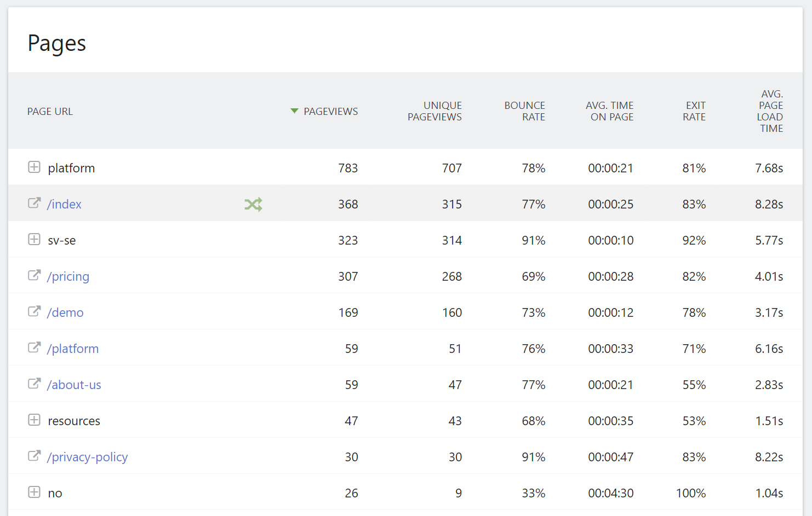

# Extellio Internship Assignment

## Task

Create a web application presenting web analytics data in charts. 
Use data.json in this repository and present one or mulitple charts representing the data. 
The data comes from Matomo and you can see the image below to get an idea how it is presented today but we want to show charts instead!
The UI design, functionality, and what data is presented is entirely up to you. 
The required libraries are mandatory but you are free to use any other libraries, frameworks or tooling you wish. 
You can use any hosted service, everything must run locally.

## Required libraries

* React
* Ant design https://ant.design/
* Echart https://echarts.apache.org/en/index.html

## Delivery

Put your code on a public GitHub repository. It should be possible to checkout and run the code locally with latest Node LTS (20). You can optionally deploy it somewhere but it is not required.

